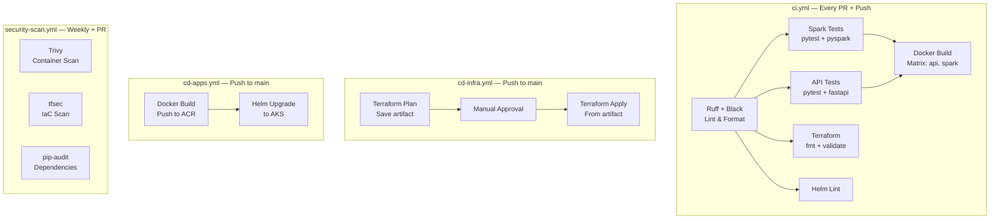

# 🔄 CI/CD — GitHub Actions Workflows

> 4 workflows covering continuous integration, infrastructure deployment, application deployment, and security scanning.

---

## 📁 Workflows

---

## 📋 Workflow Details

### `ci.yml` — Continuous Integration
| Job | Trigger | Steps |
|:---|:---|:---|
| `lint` | PR + push to main | Ruff lint, Black format check |
| `test-spark` | PR + push to main | Install PySpark 3.5.0, Delta Lake, run pytest |
| `test-api` | PR + push to main | Install FastAPI deps, run pytest |
| `validate-terraform` | PR + push to main | `terraform fmt -check`, `terraform validate` |
| `lint-helm` | PR + push to main | `helm lint` on all charts |
| `build-docker` | After tests pass | Matrix build (api, spark), no push |

### `cd-infra.yml` — Infrastructure Deployment
| Job | Trigger | Steps |
|:---|:---|:---|
| `plan` | Push to main (infrastructure/**) | OIDC login, `terraform plan`, save plan artifact |
| `apply` | After plan + environment approval | Download artifact, `terraform apply` from plan |

**Authentication:** Azure OIDC federation (no stored service principal secrets)

### `cd-apps.yml` — Application Deployment
| Job | Trigger | Steps |
|:---|:---|:---|
| `build-push` | Push to main (api/**, spark-jobs/**) | Build Docker images, push to ACR with SHA tag |
| `deploy` | After build-push | `helm upgrade --install` with image tags |

### `security-scan.yml` — Security Scanning
| Job | Trigger | Steps |
|:---|:---|:---|
| `trivy` | Weekly + PR | Scan Docker images for CVEs |
| `tfsec` | Weekly + PR | Scan Terraform for misconfigurations |
| `pip-audit` | Weekly + PR | Check Python dependencies for vulnerabilities |

---

## 🔒 Security

- **OIDC Authentication** — No stored Azure credentials; uses GitHub→Azure federation
- **Environment Protection** — Production deploys require manual approval
- **Artifact Passing** — Terraform plan saved as artifact, applied from identical plan
- **Minimal Permissions** — Each workflow uses least-privilege RBAC roles
