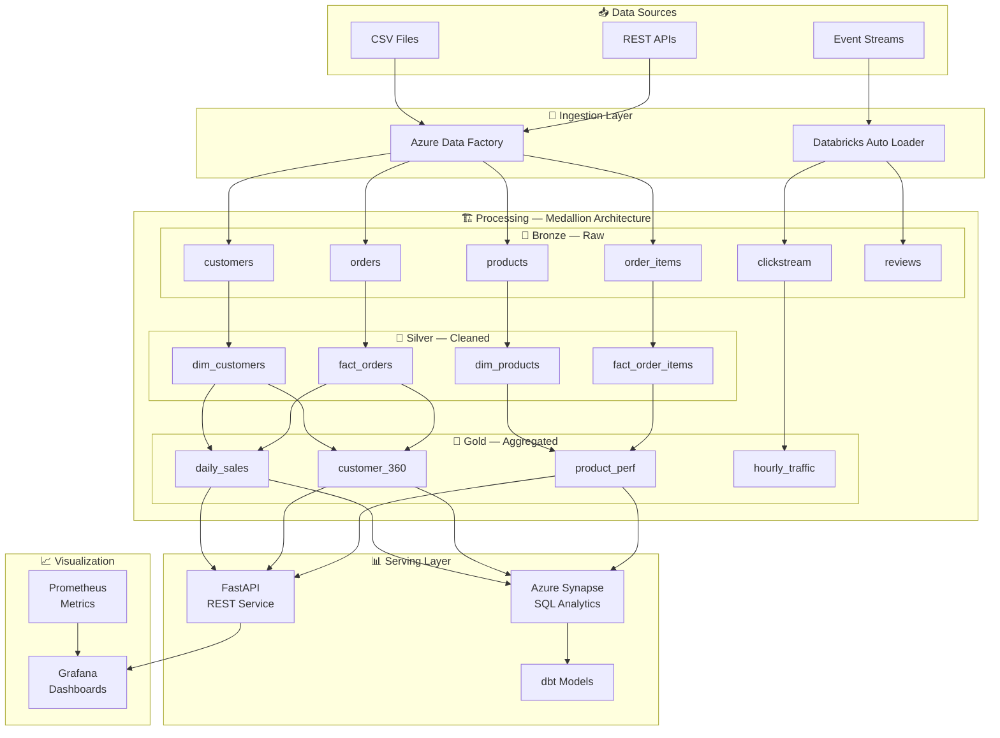
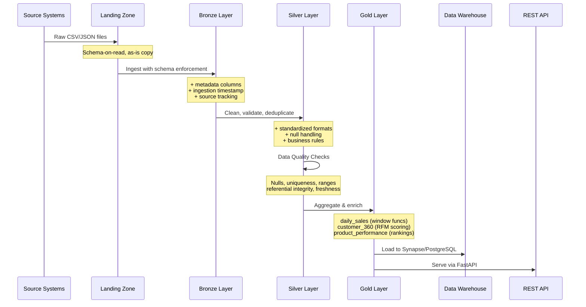
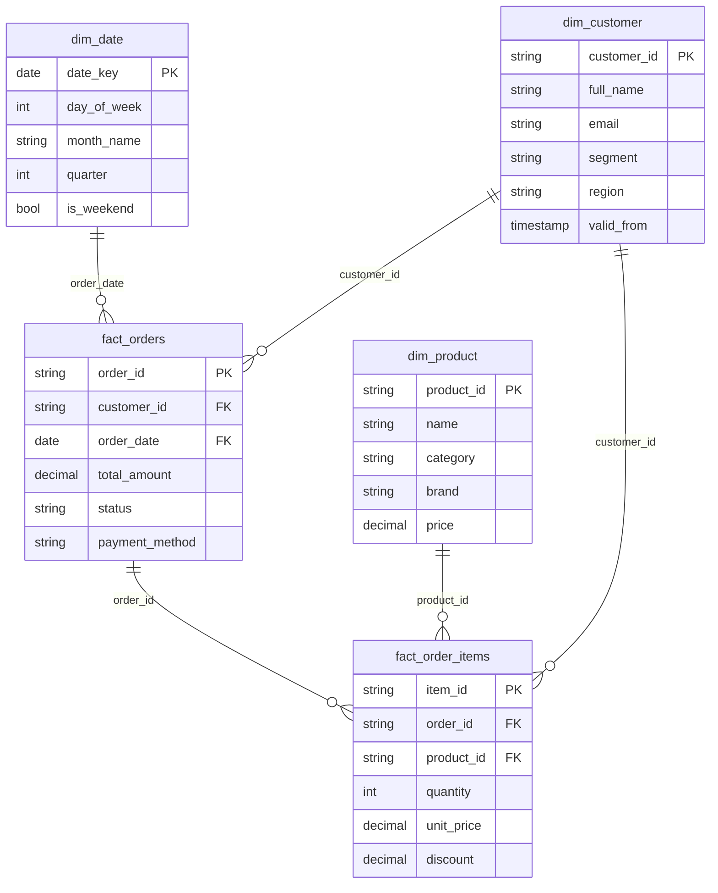
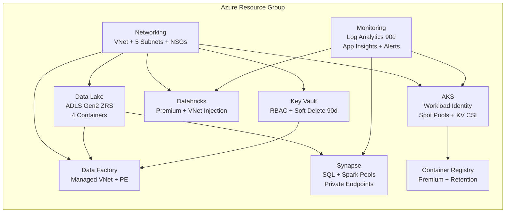
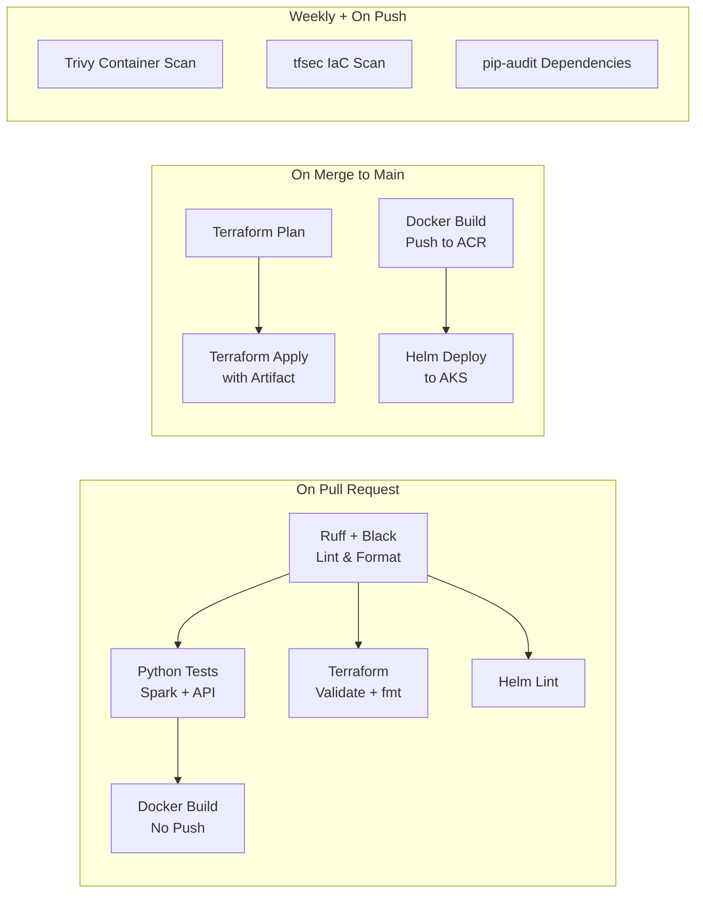

<p align="center">
  
  
  
  
  
</p>

<h1 align="center">🏗️ DataForge Platform</h1>
<h3 align="center">Enterprise Data Engineering Platform — From Ingestion to Insight</h3>

<p align="center">
  
  
  
  
</p>

---

## � What is DataForge?

DataForge is a **production-grade, end-to-end data engineering platform** that processes e-commerce analytics data through a **Medallion Architecture** (Bronze → Silver → Gold) using Azure's data services, with full CI/CD automation, container orchestration, and observability.

> **Perfect for learning:** Every component is documented with the concepts it covers. Use this as a reference implementation for interviews, certifications, or real projects.

---

## 🏛️ Architecture



---

## 🎯 Technologies & Concepts Covered

| Layer | Technology | Concepts You'll Learn |
|:---:|:---|:---|
| ☁️ | **Terraform** | IaC, modules, state management, workspaces, Azure provider |
| 🏭 | **Azure Data Factory** | Pipelines, triggers, linked services, managed VNet, parameterization |
| ⚡ | **Apache Spark / PySpark** | DataFrames, Delta Lake, schemas, partitioning, window functions |
| 📓 | **Databricks** | Notebooks, Auto Loader, Delta MERGE, OPTIMIZE, VACUUM |
| 🏢 | **Azure Synapse** | Dedicated SQL pools, Spark pools, managed VNet, private endpoints |
| 📊 | **dbt** | Staging/mart models, schema tests, macros, documentation |
| 🐳 | **Docker** | Multi-stage builds, compose, health checks, networks, volumes |
| ☸️ | **Kubernetes** | Deployments, HPA, PDB, RBAC, Ingress, security contexts |
| ⛵ | **Helm** | Charts, values, templates, helpers, NOTES.txt, releases |
| 🔄 | **GitHub Actions** | CI/CD, matrix builds, OIDC auth, artifact passing, security scanning |
| 📈 | **Prometheus + Grafana** | Metrics, alerting, dashboards, Loki log aggregation |
| 🔌 | **FastAPI** | REST API, Pydantic models, middleware, connection pooling, OpenAPI |

---

## 📁 Project Structure

```
dataforge-platform/
│
├── 📋 README.md                    ← You are here
├── 📋 Makefile                     ← 30+ automation targets
├── 📋 .env.example                 ← Environment variable template
│
├── 🏗️ infrastructure/              ← Terraform IaC (9 Azure modules)
│   ├── main.tf                     ← Root module orchestration
│   ├── variables.tf / outputs.tf
│   ├── environments/               ← dev.tfvars, prod.tfvars
│   └── modules/
│       ├── networking/             ← VNet, Subnets, NSGs
│       ├── aks/                    ← Kubernetes cluster + spot pools
│       ├── data-lake/              ← ADLS Gen2 (Medallion containers)
│       ├── data-factory/           ← ADF with managed VNet
│       ├── databricks/             ← Premium workspace, VNet injection
│       ├── synapse/                ← SQL + Spark pools
│       ├── container-registry/     ← ACR Premium
│       ├── key-vault/              ← RBAC-based access
│       └── monitoring/             ← Log Analytics + App Insights
│
├── ⚡ spark-jobs/                   ← PySpark ETL pipeline
│   ├── src/
│   │   ├── common/                 ← SparkSession factory, config, logging
│   │   ├── ingestion/              ← Landing → Bronze (schema enforcement)
│   │   ├── transformations/        ← Bronze → Silver → Gold
│   │   ├── quality/                ← Data quality checker
│   │   └── pipeline.py             ← Orchestrator
│   └── tests/                      ← pytest suite
│
├── 🏭 data-factory/                ← ADF pipeline definitions
│   ├── pipeline/                   ← Ingest, transform, aggregate, orchestrate
│   ├── trigger/                    ← Daily ETL trigger
│   ├── linkedService/              ← ADLS linked service (managed identity)
│   └── dataset/                    ← Parameterized datasets
│
├── 📓 databricks/notebooks/        ← 6 interactive notebooks
│   ├── 01_explore_raw_data.py
│   ├── 02_bronze_ingestion.py      ← Batch + Auto Loader
│   ├── 03_silver_transformation.py ← Delta MERGE upserts
│   ├── 04_gold_aggregation.py
│   ├── 05_pipeline_orchestration.py ← Multi-step orchestrator
│   └── 06_data_quality_checks.py
│
├── 🏢 data-warehouse/              ← SQL + dbt
│   ├── migrations/                 ← V001 star schema DDL
│   └── dbt/
│       ├── models/staging/         ← stg_customers, stg_orders
│       ├── models/marts/           ← mart_daily_sales, mart_customer_360
│       └── macros/                 ← generate_date_spine
│
├── 🐳 docker/                      ← Container configurations
│   ├── docker-compose.yml          ← App stack (5 services)
│   ├── docker-compose.monitoring.yml ← Monitoring stack (6 services)
│   └── spark/                      ← Multi-stage Spark Dockerfile
│
├── 🔌 api/                         ← FastAPI analytics service
│   ├── app/main.py                 ← Endpoints + connection pooling + CORS
│   ├── app/models.py               ← Pydantic response models
│   └── tests/                      ← pytest API tests
│
├── 🎲 data-generator/              ← Faker-based data generation
│   └── src/generate.py             ← Realistic e-commerce data (6 tables)
│
├── ☸️ kubernetes/                   ← K8s manifests
│   ├── namespaces/                 ← Namespace definitions
│   ├── api/                        ← Full API deployment (HPA, PDB, RBAC, Ingress)
│   └── spark/                      ← Spark master + worker + HPA
│
├── ⛵ helm-charts/                  ← Helm umbrella chart
│   └── dataforge-platform/
│       ├── Chart.yaml / values.yaml
│       └── templates/              ← api.yaml, spark.yaml, NOTES.txt
│
├── 📈 monitoring/                   ← Observability stack
│   ├── prometheus/                 ← Scrape configs + alert rules
│   ├── grafana/                    ← 3 dashboards + provisioning
│   ├── alertmanager/               ← Alert routing
│   └── loki/                       ← Log aggregation
│
├── 🔄 .github/workflows/           ← CI/CD pipelines
│   ├── ci.yml                      ← Lint, test, validate, build
│   ├── cd-infra.yml                ← Terraform plan → apply with OIDC
│   ├── cd-apps.yml                 ← Docker → ACR → Helm → AKS
│   └── security-scan.yml          ← Trivy + tfsec + pip-audit
│
└── 🔧 scripts/                     ← One-click setup
    ├── setup.sh / setup.ps1        ← Cross-platform bootstrapping
    └── teardown.sh                 ← Graceful cleanup
```

---

## ⚡ Quick Start

### Prerequisites

| Tool | Version | Purpose |
|:---|:---|:---|
| Docker Desktop | 24+ | Container runtime |
| Python | 3.11+ | Spark jobs, API, generator |
| Java | 17 | Spark dependency |
| Git | 2.40+ | Version control |

### Option 1: One-Click Setup

**Linux / macOS:**
```bash
git clone https://github.com/SanjaySundarMurthy/dataforge-platform.git
cd dataforge-platform
chmod +x scripts/setup.sh
./scripts/setup.sh full
```

**Windows PowerShell:**
```powershell
git clone https://github.com/SanjaySundarMurthy/dataforge-platform.git
cd dataforge-platform
.\scripts\setup.ps1 -Mode full
```

### Option 2: Step-by-Step

```bash
# 1. Clone and prepare
git clone https://github.com/SanjaySundarMurthy/dataforge-platform.git
cd dataforge-platform
cp .env.example .env            # Edit with your values

# 2. Start services
docker compose -f docker/docker-compose.yml up -d

# 3. Generate sample data
pip install faker psycopg2-binary
python data-generator/src/generate.py --output-dir ./data/landing --rows 5000

# 4. Run Spark pipeline
pip install pyspark==3.5.0 delta-spark==3.0.0
cd spark-jobs && python -m pytest tests/ -v   # Run tests first
python src/pipeline.py                         # Run full pipeline

# 5. Start monitoring
docker compose -f docker/docker-compose.monitoring.yml up -d

# 6. Access services
# API Docs:     http://localhost:8000/docs
# Spark UI:     http://localhost:8080
# Grafana:      http://localhost:3000
# Prometheus:   http://localhost:9090
```

### Option 3: Cloud Deployment (Azure)

```bash
# 1. Authenticate
az login
az account set --subscription "<YOUR_SUBSCRIPTION_ID>"

# 2. Initialize Terraform
cd infrastructure
terraform init

# 3. Plan and apply
terraform plan -var-file=environments/dev.tfvars -var="synapse_sql_admin_password=YourStr0ngP@ss!"
terraform apply -var-file=environments/dev.tfvars -var="synapse_sql_admin_password=YourStr0ngP@ss!"
```

---

## 🔄 Data Pipeline Flow



---

## 🥉🥈🥇 Medallion Architecture Deep Dive

### Bronze Layer (Raw)
- **What:** Exact copy of source data with metadata columns added
- **Format:** Parquet / Delta Lake with partitioning
- **Columns Added:** `_ingested_at`, `_source_file`, `_batch_id`
- **Key File:** `spark-jobs/src/ingestion/file_ingestion.py`

### Silver Layer (Cleaned)
- **What:** Validated, deduplicated, standardized data
- **Transformations:**
  - Remove duplicates (window + row_number)
  - Standardize formats (emails lowercase, names titlecase)
  - Filter invalid records (negative prices, future dates)
  - Enrich with derived columns
- **Key File:** `spark-jobs/src/transformations/bronze_to_silver.py`

### Gold Layer (Aggregated)
- **What:** Business-ready aggregated datasets
- **Aggregations:**

| Dataset | Technique | Description |
|:---|:---|:---|
| `daily_sales` | Window functions | Running totals, 7-day moving average, YTD revenue |
| `customer_360` | RFM Scoring | Recency-Frequency-Monetary tier assignment |
| `product_performance` | DENSE_RANK | Category and overall revenue rankings |
| `hourly_traffic` | Time bucketing | Conversion rates, bounce rates by hour |

- **Key File:** `spark-jobs/src/transformations/silver_to_gold.py`

---

## 🏢 Data Warehouse — Star Schema



---

## ☁️ Infrastructure Modules



Each module is self-contained with `main.tf`, `variables.tf`, and `outputs.tf`. See [infrastructure/README.md](infrastructure/README.md) for detailed module documentation.

---

## 🔄 CI/CD Pipeline



| Workflow | Trigger | What It Does |
|:---|:---|:---|
| `ci.yml` | PR + push to main | Lint, test, validate, build |
| `cd-infra.yml` | Push to main (infrastructure/**) | Terraform plan → apply with OIDC |
| `cd-apps.yml` | Push to main (app code) | Docker → ACR → Helm → AKS |
| `security-scan.yml` | Weekly + PR | Trivy, tfsec, pip-audit |

---

## 📈 Monitoring & Observability

### Dashboards

| Dashboard | Panels | Purpose |
|:---|:---|:---|
| **Pipeline Overview** | Status, duration, records, quality score | ETL pipeline health |
| **Infrastructure** | CPU, memory, disk, network, uptime | System resource monitoring |
| **API Performance** | Request rate, latency percentiles, errors | Service level monitoring |

### Alert Rules

| Alert | Condition | Severity |
|:---|:---|:---|
| Pipeline Stale | No success in 25 hours | Warning |
| Pipeline Failure Rate | >10% failures/hour | Critical |
| API High Latency | p95 > 2 seconds | Warning |
| API Down | Target unreachable 2 min | Critical |
| High CPU Usage | >85% for 10 min | Warning |
| High Memory Usage | >90% for 10 min | Critical |
| Data Quality Failure | Any check fails | Warning |

### Service URLs (Local)

| Service | URL |
|:---|:---|
| API Documentation | http://localhost:8000/docs |
| API Metrics | http://localhost:8000/metrics |
| Spark Master UI | http://localhost:8080 |
| Grafana | http://localhost:3000 |
| Prometheus | http://localhost:9090 |
| Alertmanager | http://localhost:9093 |

---

## 🧪 Testing

```bash
# Run all Spark ETL tests
cd spark-jobs && python -m pytest tests/ -v --cov=src

# Run API tests
cd api && python -m pytest tests/ -v

# Validate Terraform
cd infrastructure && terraform validate

# Lint Helm chart
helm lint helm-charts/dataforge-platform

# dbt compile
cd data-warehouse/dbt && dbt compile
```

---

## 🛡️ Security Features

| Feature | Implementation |
|:---|:---|
| **Network Isolation** | VNet with dedicated subnets, NSGs, private endpoints |
| **Identity** | Managed Identity everywhere, RBAC, workload identity on AKS |
| **Secrets** | Key Vault with RBAC, CSI driver on AKS, no hardcoded credentials |
| **Encryption** | TLS 1.2+, Azure-managed keys on storage, HTTPS-only |
| **Container Security** | Non-root users, read-only filesystem, dropped capabilities |
| **CI/CD Security** | OIDC auth (no stored secrets), Trivy scanning, tfsec, pip-audit |
| **Data Protection** | Soft delete, ZRS replication, geo-backup, lifecycle policies |
| **Access Control** | Azure AD RBAC, Calico network policy, Ingress rate limiting |

---

## ⚠️ Failure Handling

### Pipeline Failures
- **Spark:** Each stage has try/catch blocks. Quality gate between Silver→Gold can halt the pipeline on bad data.
- **ADF:** Retry policies on all activities (3 retries, 30s interval). Failure notifications via webhook.
- **Databricks:** `05_pipeline_orchestration.py` manages state tracking and supports `fail_on_error` toggle per step.

### Infrastructure Failures
- **AKS:** HPA auto-scales on load. PDB ensures availability during rolling updates. Spot pool handles eviction gracefully.
- **Storage:** ZRS replication protects against datacenter failures. Soft delete for accidental data deletion recovery.
- **Database:** Synapse geo-backup enabled. Auto-pause conserves costs during inactivity.

### Monitoring Failures
- **Alertmanager:** Inhibition rules prevent alert storms. Critical alerts suppress related warnings.
- **Prometheus:** 7-day retention with persistent storage. Auto-discovery for new scrape targets.
- **Grafana:** Pre-provisioned dashboards survive container restarts via volume mounts.

---

## 🔧 Make Targets

```bash
make help           # Show all available targets

# Docker
make up             # Start all services
make down           # Stop all services
make logs           # Tail container logs

# Testing
make test           # Run all tests
make lint           # Lint Python code
make format         # Auto-format code

# Data Operations
make generate-data  # Generate sample data
make run-pipeline   # Run full Spark pipeline

# Infrastructure
make infra-plan     # Terraform plan
make infra-apply    # Terraform apply

# Kubernetes
make k8s-apply      # Apply K8s manifests
make helm-install   # Helm install/upgrade

# Monitoring
make monitoring-up  # Start monitoring stack
```

---

## 🤝 Contributing

1. Fork the repository
2. Create a feature branch (`git checkout -b feature/amazing-feature`)
3. Commit changes (`git commit -m 'feat: add amazing feature'`)
4. Push to branch (`git push origin feature/amazing-feature`)
5. Open a Pull Request

---

## 📄 License

This project is licensed under the MIT License — see the [LICENSE](LICENSE) file for details.

---

<p align="center">
  <b>Built with ❤️ for the data engineering community</b><br/>
  <i>Star ⭐ this repo if you find it useful!</i>
</p>
