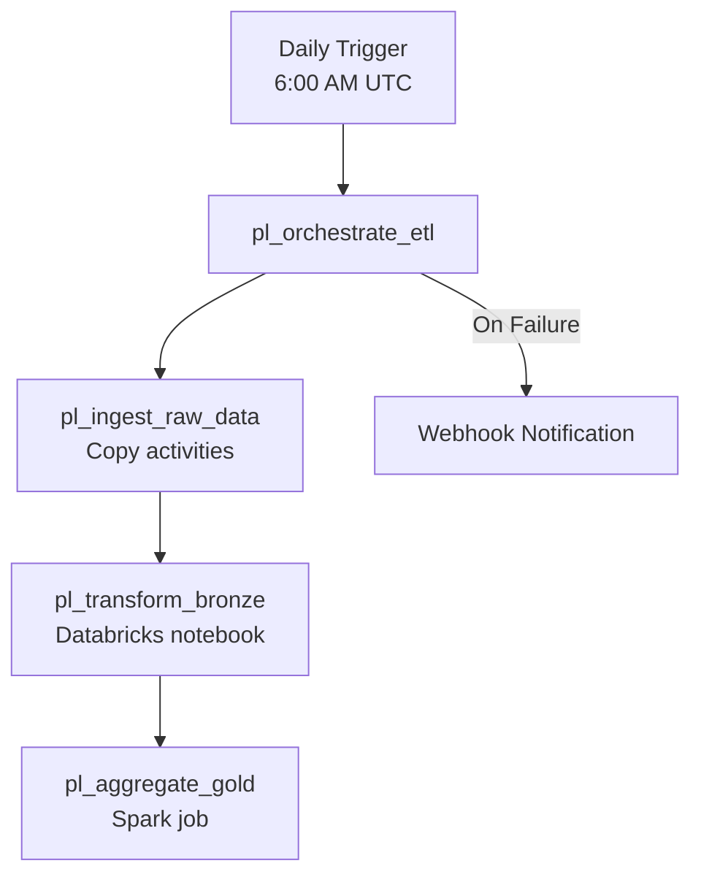

# 🏭 Data Factory — ADF Pipeline Definitions

> Azure Data Factory pipeline definitions for orchestrating the full ETL workflow from source systems through the Medallion Architecture.

---

## 📁 Structure

```
data-factory/
├── pipeline/
│   ├── pl_ingest_raw_data.json       # Source → Landing zone ingestion
│   ├── pl_transform_bronze.json      # Landing → Bronze layer
│   ├── pl_aggregate_gold.json        # Silver → Gold aggregations
│   └── pl_orchestrate_etl.json       # Master orchestrator (runs all)
├── trigger/
│   └── tr_daily_etl.json             # Daily schedule trigger (6:00 AM UTC)
├── linkedService/
│   └── ls_adls_dataforge.json        # ADLS Gen2 linked service (managed identity)
├── dataset/
│   └── ds_adls_parquet.json          # Parameterized Parquet dataset
└── dataflow/
    └── df_clean_transform.json       # Mapping data flow (visual ETL)
```

---

## 🔄 Pipeline Flow



---

## 🔑 Key Features

| Feature | Implementation |
|:---|:---|
| **Managed Identity** | No stored credentials — uses system-assigned identity |
| **Parameterized Datasets** | Single dataset definition, parameters for container/path |
| **Retry Policy** | 3 retries, 30-second intervals on all activities |
| **Managed VNet** | Data Factory runs in managed virtual network |
| **DFS Endpoint** | Connects to ADLS via `dfs.core.windows.net` (Gen2) |

---

## 🚀 Deployment

Pipelines are deployed automatically via the `cd-infra.yml` GitHub Actions workflow. For manual deployment:

```bash
# Export from ADF Studio → ARM template
# Or use the ADF CI/CD integration with Git
```
