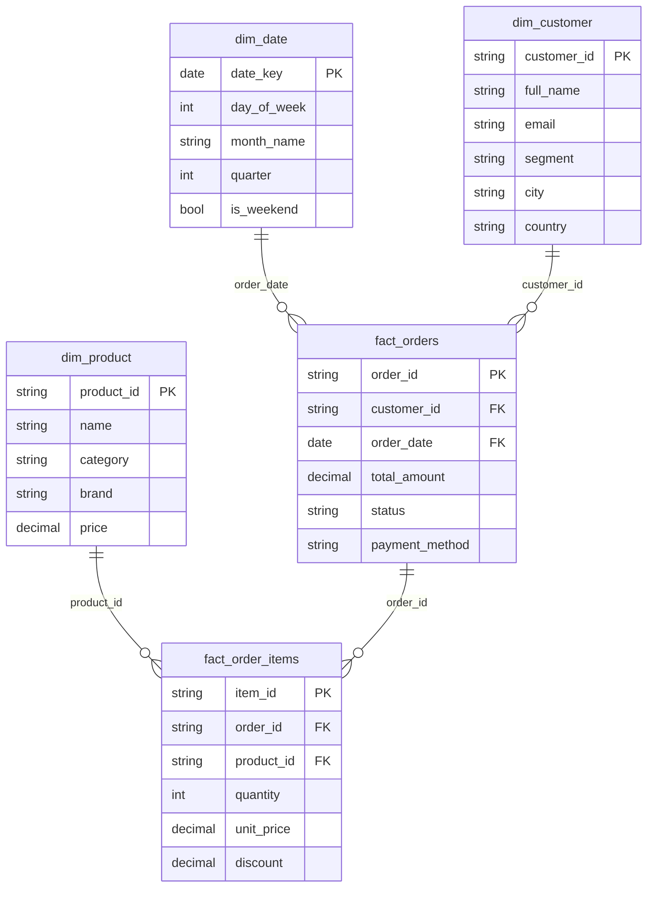
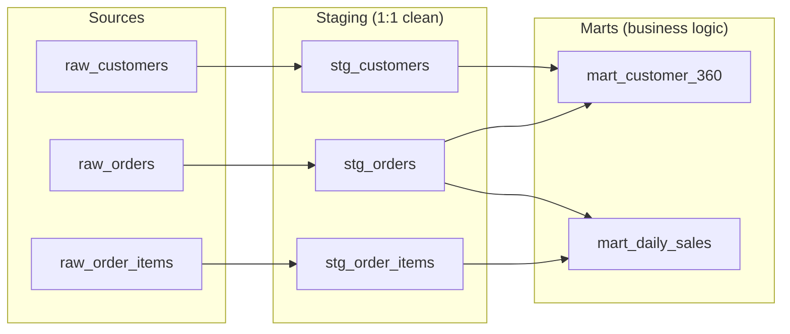

# 🏢 Data Warehouse — Star Schema & dbt

> Star schema design with dbt transformations for analytics-ready data serving.

---

## 🏛️ Schema Design



---

## 📁 Structure

```
data-warehouse/
├── migrations/
│   └── V001__initial_schema.sql     # Star schema DDL
└── dbt/
    ├── dbt_project.yml              # dbt configuration
    ├── packages.yml                 # Dependencies (dbt_utils)
    ├── profiles.yml                 # Connection profiles
    ├── models/
    │   ├── staging/                 # 1:1 source cleaning
    │   │   ├── stg_customers.sql
    │   │   ├── stg_orders.sql
    │   │   ├── stg_order_items.sql
    │   │   └── schema.yml          # Column tests
    │   └── marts/                   # Business aggregations
    │       ├── mart_daily_sales.sql
    │       ├── mart_customer_360.sql
    │       └── schema.yml
    ├── macros/
    │   └── generate_date_spine.sql  # Reusable date helper
    └── tests/                       # Custom data tests
```

---

## 🔄 dbt Model Flow



---

## 📊 Models

### Staging Models
Staging models perform minimal transformations — they are a 1:1 mapping from source with:
- Column renaming for consistency
- Type casting
- Null handling
- Timestamp standardization

### Mart Models

**`mart_daily_sales`** — Daily revenue aggregation
- Total orders, total revenue, average order value
- Day-over-day and week-over-week growth
- Running monthly total

**`mart_customer_360`** — Customer analytics
- Total orders, total spend, average order value
- First and last order dates
- Customer lifetime (days)
- Segment classification

---

## 🚀 Running

```bash
cd data-warehouse/dbt

# Install dependencies
dbt deps

# Compile models (dry run)
dbt compile

# Run all models
dbt run

# Test data quality
dbt test

# Generate documentation
dbt docs generate
dbt docs serve
```

---

## 📋 Schema Tests

Defined in `schema.yml` files:

| Test | Applied To | Purpose |
|:---|:---|:---|
| `unique` | Primary keys | No duplicate records |
| `not_null` | Required columns | Data completeness |
| `accepted_values` | Status, segment | Valid enum values |
| `relationships` | Foreign keys | Referential integrity |

---

## 🗃️ Migration

The initial schema migration (`V001__initial_schema.sql`) creates:
- Dimension tables with appropriate indexes
- Fact tables with foreign key constraints
- Date dimension with pre-populated values
- Materialized view stubs for common queries
