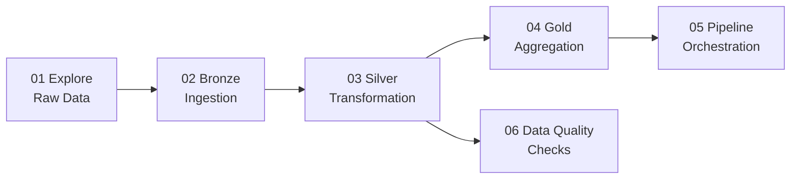

# 📓 Databricks — Notebooks & Pipeline

> 6 interactive notebooks implementing the full Medallion Architecture on Databricks with Delta Lake, Auto Loader, and pipeline orchestration.

---

## 📁 Notebooks



| # | Notebook | Purpose | Key Concepts |
|:---:|:---|:---|:---|
| 01 | `explore_raw_data.py` | Profile landing zone data | Spark SQL, `describe()`, `printSchema()`, sampling |
| 02 | `bronze_ingestion.py` | Ingest to Bronze layer | Schema enforcement, Auto Loader, metadata columns |
| 03 | `silver_transformation.py` | Clean and validate | Delta MERGE (upsert), dedup, SCD Type 1 |
| 04 | `gold_aggregation.py` | Business aggregations | Window functions, DENSE_RANK, ntile |
| 05 | `pipeline_orchestration.py` | End-to-end orchestrator | State tracking, error handling, audit logging |
| 06 | `data_quality_checks.py` | Quality validation | Completeness, uniqueness, freshness, referential |

---

## 🔑 Key Concepts by Notebook

### 02 — Bronze Ingestion
```python
# Auto Loader — incremental file ingestion
df = (spark.readStream
    .format("cloudFiles")
    .option("cloudFiles.format", "csv")
    .option("cloudFiles.schemaLocation", checkpoint_path)
    .load(landing_path))
```
- **Auto Loader** automatically discovers new files — no manual file listing
- **Schema enforcement** prevents bad data from entering the lake
- **Metadata columns** (`_ingested_at`, `_source_file`) enable lineage tracking

### 03 — Silver Transformation
```python
# Delta MERGE — upsert pattern
deltaTable.alias("target").merge(
    updates.alias("source"),
    "target.customer_id = source.customer_id"
).whenMatchedUpdateAll().whenNotMatchedInsertAll().execute()
```
- **MERGE** enables idempotent upserts (re-run safe)
- **Deduplication** via `Window + row_number()` keeps latest record
- **SCD Type 1** overwrites changed dimensions

### 04 — Gold Aggregation
```python
# Window functions for running totals
window_spec = Window.partitionBy("customer_id").orderBy("order_date")
df.withColumn("running_total", F.sum("amount").over(window_spec))
```

### 05 — Pipeline Orchestration
- Runs all stages sequentially with **state tracking**
- Records step start/end times, status, error messages
- Writes audit log to `pipeline_audit` Delta table
- Configurable `fail_on_error` toggle per step

### 06 — Data Quality
- **Completeness:** `count(non-null) / count(*)` per column
- **Uniqueness:** `count(distinct PK) == count(*)`
- **Recency:** `max(_ingested_at)` within expected window
- **Referential:** FK values exist in dimension tables

---

## 🚀 Running on Databricks

1. Import notebooks to your Databricks workspace
2. Attach to a cluster with Delta Lake runtime
3. Set widget parameters for `environment` and paths
4. Run notebooks in order: `01` → `02` → `03` → `04` → `06`
5. Or run `05` to execute the full pipeline automatically

---

## 📊 Delta Lake Operations

| Operation | Purpose | When to Use |
|:---|:---|:---|
| `MERGE INTO` | Upsert (insert or update) | Bronze → Silver, incremental loads |
| `OPTIMIZE` | Compact small files | After many small writes |
| `VACUUM` | Delete old file versions | Storage cleanup (default 7-day retention) |
| `DESCRIBE HISTORY` | View table history | Auditing, debugging |
| `RESTORE` | Time travel to version | Rollback bad data |
