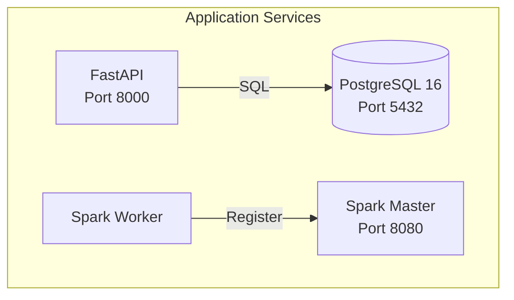
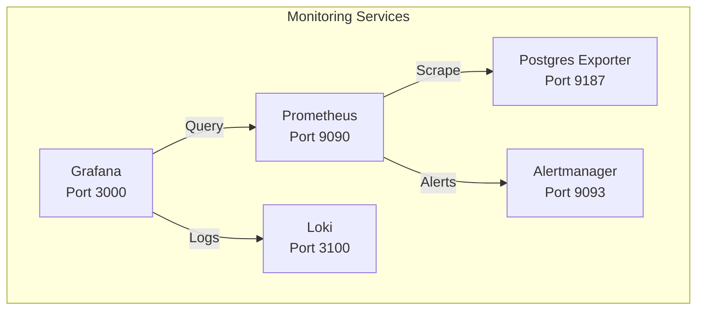

# 🐳 Docker — Container Configurations

> Docker Compose stacks for local development: application services and monitoring.

---

## 📁 Structure

```
docker/
├── docker-compose.yml               # Application stack
├── docker-compose.monitoring.yml     # Monitoring stack
├── spark/
│   └── Dockerfile                    # Multi-stage PySpark image
└── api/
    └── Dockerfile                    # FastAPI production image
```

---

## 🚀 Application Stack (`docker-compose.yml`)



| Service | Image | Ports | Purpose |
|:---|:---|:---|:---|
| `postgres` | `postgres:16-alpine` | 5432 | Data warehouse |
| `api` | `dataforge-api` | 8000 | Analytics REST API |
| `spark-master` | `dataforge-spark` | 8080, 7077 | Spark cluster master |
| `spark-worker` | `dataforge-spark` | 8081 | Spark executor |

### Running

```bash
# Start all services
docker compose -f docker/docker-compose.yml up -d

# Check status
docker compose -f docker/docker-compose.yml ps

# View logs
docker compose -f docker/docker-compose.yml logs -f api

# Stop
docker compose -f docker/docker-compose.yml down
```

---

## 📈 Monitoring Stack (`docker-compose.monitoring.yml`)



| Service | Image | Ports | Purpose |
|:---|:---|:---|:---|
| `prometheus` | `prom/prometheus:v2.48.0` | 9090 | Metrics collection |
| `grafana` | `grafana/grafana:10.2.0` | 3000 | Dashboards |
| `alertmanager` | `prom/alertmanager:v0.26.0` | 9093 | Alert routing |
| `loki` | `grafana/loki:2.9.0` | 3100 | Log aggregation |
| `postgres-exporter` | `prometheuscommunity/postgres-exporter:v0.15.0` | 9187 | DB metrics |

### Running

```bash
# Start monitoring
docker compose -f docker/docker-compose.monitoring.yml up -d

# Access Grafana
open http://localhost:3000
# Default: admin / (set on first login)
```

---

## 🔒 Security

- All images pinned to specific versions (no `latest` tags)
- Non-root users in custom Dockerfiles
- Health checks on all services
- Environment variables for credentials (never hardcoded)
- Volumes for data persistence across restarts
