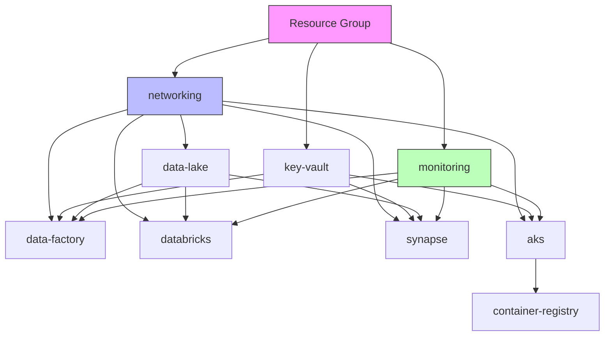

# ☁️ Infrastructure — Terraform Modules

> 9 Azure modules composing a production-grade data engineering platform with network isolation, managed identities, and full observability.

---

## 🏛️ Module Dependency Graph



---

## 📦 Modules

### 1. Networking (`modules/networking/`)

Creates the foundational Virtual Network with 5 dedicated subnets and NSGs.

| Resource | Description |
|:---|:---|
| VNet | Address space `10.0.0.0/16` |
| `default` subnet | General workloads `10.0.1.0/24` |
| `aks` subnet | AKS node pool `10.0.2.0/24` |
| `data` subnet | Data services `10.0.3.0/24` |
| `databricks-private` | Databricks host subnet `10.0.4.0/24` |
| `databricks-public` | Databricks container subnet `10.0.5.0/24` |
| NSGs | Per-subnet network security groups with deny-all defaults |

**Key Outputs:** `vnet_id`, `subnet_ids`, `databricks_private_nsg_association_id`, `databricks_public_nsg_association_id`

---

### 2. Data Lake (`modules/data-lake/`)

ADLS Gen2 storage account with Medallion Architecture containers.

| Feature | Configuration |
|:---|:---|
| SKU | Standard / ZRS (Zone-Redundant Storage) |
| HNS | Hierarchical Namespace enabled (ADLS Gen2) |
| Containers | `landing`, `bronze`, `silver`, `gold` |
| Security | HTTPS-only, TLS 1.2, managed identity access |
| Lifecycle | Blob retention policies |

---

### 3. Data Factory (`modules/data-factory/`)

Azure Data Factory with managed identity and private endpoints.

| Feature | Configuration |
|:---|:---|
| Identity | System-assigned managed identity |
| VNet | Managed Virtual Network integration |
| Linked Service | ADLS Gen2 via DFS endpoint (managed identity auth) |
| Diagnostics | Logs → Log Analytics workspace |

---

### 4. Databricks (`modules/databricks/`)

Premium workspace with VNet injection for network isolation.

| Feature | Configuration |
|:---|:---|
| SKU | Premium (Unity Catalog, RBAC, audit logs) |
| Network | VNet injection into private/public subnets |
| NSG | Proper association IDs for subnet delegation |
| Diagnostics | DBFS, clusters, accounts, jobs, notebook logs → Log Analytics |

---

### 5. Synapse (`modules/synapse/`)

Azure Synapse Analytics with dedicated SQL pool and Spark pool.

| Feature | Configuration |
|:---|:---|
| SQL Pool | DW100c, geo-backup enabled |
| Spark Pool | 3-10 nodes (auto-scale), auto-pause at 15 min |
| Network | Managed VNet, private endpoints for SQL + Dev |
| Security | AAD-only admin, data exfiltration protection |
| Firewall | Azure services allowed |

---

### 6. AKS (`modules/aks/`)

Azure Kubernetes Service with workload identity and spot node pools.

| Feature | Configuration |
|:---|:---|
| Version | Kubernetes 1.29 |
| System Pool | 2 Standard_D2s_v3 nodes |
| Spot Pool | 0-5 Standard_D4s_v3 (cost optimization) |
| Identity | Workload Identity + OIDC issuer |
| Add-ons | Key Vault CSI driver, Azure Policy, OMS Agent |
| Network | Azure CNI, Calico network policy |

---

### 7. Container Registry (`modules/container-registry/`)

| Feature | Configuration |
|:---|:---|
| SKU | Premium (geo-replication, retention, zone redundancy) |
| Zone Redundancy | Enabled |
| Retention | 30-day untagged image retention |
| Admin | Disabled (use managed identity) |
| AKS Pull | Role assignment for AKS kubelet identity |

---

### 8. Key Vault (`modules/key-vault/`)

| Feature | Configuration |
|:---|:---|
| Access Model | RBAC (no access policies) |
| Soft Delete | 90-day retention |
| Purge Protection | Enabled |
| Network | Firewall with Azure services bypass |

---

### 9. Monitoring (`modules/monitoring/`)

| Feature | Configuration |
|:---|:---|
| Log Analytics | Configurable retention (default 90 days) |
| App Insights | Workspace-backed |
| Alerts | Configurable email receiver, metric alerts |
| Solution | ContainerInsights for AKS |

---

## 🚀 Deployment

```bash
# Initialize
cd infrastructure
terraform init

# Plan with environment config
terraform plan -var-file=environments/dev.tfvars \
  -var="synapse_sql_admin_password=YourStr0ngP@ss!"

# Apply
terraform apply -var-file=environments/dev.tfvars \
  -var="synapse_sql_admin_password=YourStr0ngP@ss!"

# Destroy (with caution)
terraform destroy -var-file=environments/dev.tfvars
```

---

## 🔒 Security Highlights

- **No hardcoded secrets** — All credentials via variables or Key Vault
- **Managed Identity** — System-assigned identity for service-to-service auth
- **Network isolation** — Private endpoints, VNet injection, NSGs
- **RBAC everywhere** — Key Vault, ACR, storage all use Azure AD RBAC
- **Encryption** — TLS 1.2+, HTTPS-only, Azure-managed keys
- **Password validation** — Synapse admin password requires 12+ chars with complexity
- **Soft delete** — Key Vault (90d), storage blob retention, Synapse geo-backup
