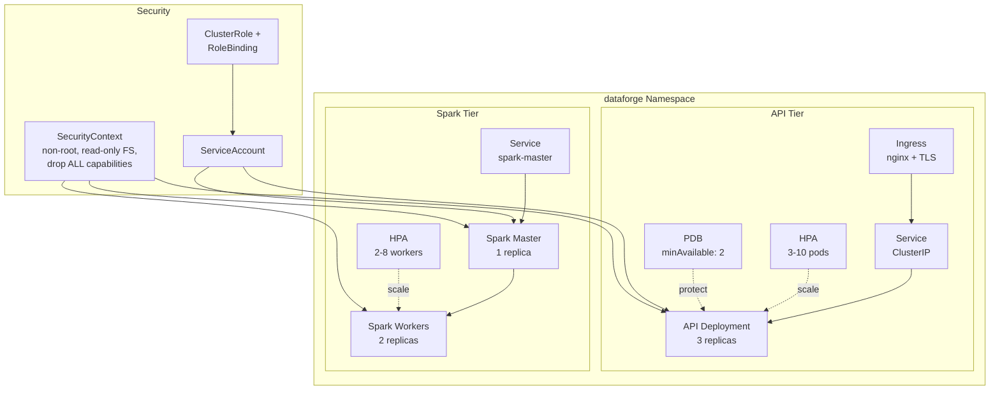

# ☸️ Kubernetes — Deployment Manifests

> Production-grade Kubernetes manifests with security contexts, HPA, PDB, RBAC, and Ingress.

---

## 🏛️ Cluster Architecture



---

## 📁 Structure

```
kubernetes/
├── namespaces/
│   └── dataforge-namespace.yaml    # Namespace definition
├── api/
│   ├── api-deployment.yaml         # Deployment + Service + HPA + PDB
│   ├── api-ingress.yaml            # TLS Ingress (rate limiting)
│   └── api-rbac.yaml               # ServiceAccount + RBAC
└── spark/
    └── spark-deployment.yaml       # Master + Worker + HPA + Services
```

---

## 🔒 Security Features

Every pod runs with:
```yaml
securityContext:
  runAsNonRoot: true
  runAsUser: 1000
  fsGroup: 1000
  allowPrivilegeEscalation: false
  readOnlyRootFilesystem: true
  capabilities:
    drop: ["ALL"]
```

| Feature | Description |
|:---|:---|
| **Non-root** | All containers run as UID 1000 |
| **Read-only FS** | Root filesystem is immutable |
| **Dropped capabilities** | No Linux capabilities granted |
| **RBAC** | Dedicated ServiceAccount with least-privilege roles |
| **PDB** | Minimum 2 API pods available during disruptions |
| **Network Policy** | Namespace isolation (when Calico/Cilium is installed) |

---

## 🚀 Deploying

```bash
# Create namespace
kubectl apply -f kubernetes/namespaces/

# Deploy API
kubectl apply -f kubernetes/api/

# Deploy Spark
kubectl apply -f kubernetes/spark/

# Check status
kubectl get all -n dataforge

# Port forward to test
kubectl port-forward -n dataforge svc/dataforge-api 8000:80
```

---

## 📊 Scaling

### Horizontal Pod Autoscaler (HPA)

| Workload | Min | Max | CPU Target | Memory Target |
|:---|:---|:---|:---|:---|
| API | 3 | 10 | 70% | 80% |
| Spark Worker | 2 | 8 | 75% | — |

### Pod Disruption Budget (PDB)

| Workload | MinAvailable | Purpose |
|:---|:---|:---|
| API | 2 | Ensure service availability during node drains |

---

## 🌐 Ingress

| Feature | Configuration |
|:---|:---|
| Controller | nginx-ingress |
| TLS | cert-manager auto-provisioned |
| Rate Limiting | 100 requests/second |
| Proxy Body Size | 10MB |
| Host | `api.dataforge.example.com` |
