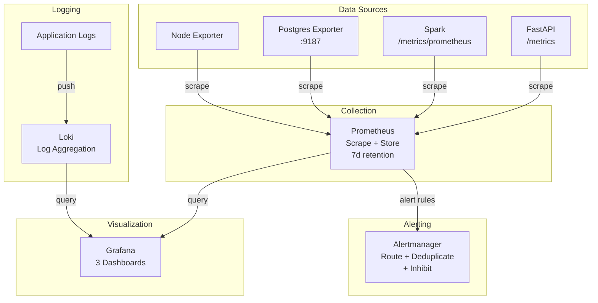
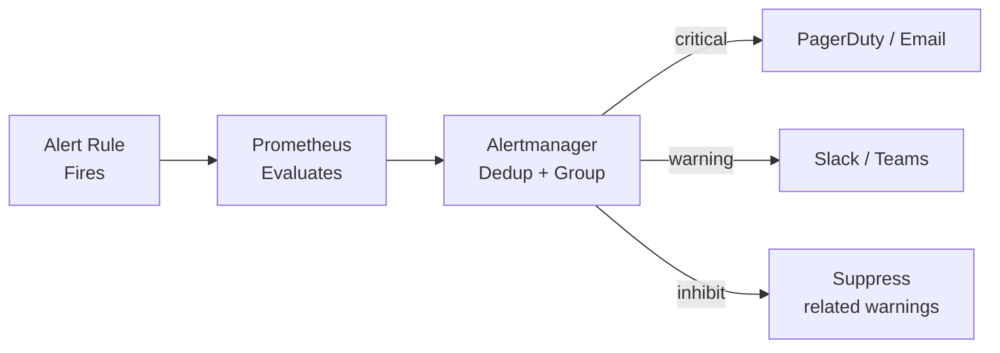

# 📈 Monitoring — Observability Stack

> Full observability with Prometheus metrics, Grafana dashboards, Alertmanager routing, and Loki log aggregation.

---

## 🏛️ Stack Architecture



---

## 📁 Structure

```
monitoring/
├── prometheus/
│   ├── prometheus.yml           # Scrape configuration
│   └── alert_rules.yml          # Alert definitions
├── grafana/
│   ├── provisioning/
│   │   ├── dashboards/config.yml  # Auto-provision config
│   │   └── datasources/config.yml # Prometheus + Loki sources
│   └── dashboards/
│       ├── pipeline-overview.json   # ETL pipeline health
│       ├── infrastructure.json      # System resources
│       └── api-performance.json     # API latency/throughput
├── alertmanager/
│   └── alertmanager.yml         # Alert routing and receivers
└── loki/
    └── loki-config.yml          # Storage and retention config
```

---

## 📊 Dashboards

### Pipeline Overview
| Panel | Metric | Purpose |
|:---|:---|:---|
| Pipeline Status | `pipeline_runs_total` | Success/failure counts |
| Duration | `pipeline_duration_seconds` | Stage-by-stage timing |
| Records Processed | `pipeline_records_total` | Throughput tracking |
| Quality Score | `data_quality_score` | Quality gate results |

### Infrastructure
| Panel | Metric | Purpose |
|:---|:---|:---|
| CPU Usage | `process_cpu_seconds_total` | CPU saturation |
| Memory | `process_resident_memory_bytes` | Memory pressure |
| Disk I/O | `node_disk_io_time_seconds_total` | Storage bottlenecks |
| Network | `node_network_receive_bytes_total` | Bandwidth usage |

### API Performance
| Panel | Metric | Purpose |
|:---|:---|:---|
| Request Rate | `http_requests_total` | Throughput (req/s) |
| Latency p95 | `http_request_duration_seconds` | Response time SLO |
| Error Rate | `http_requests_total{status=~"5.."}` | Reliability |
| Active Connections | `pg_stat_activity_count` | DB pool saturation |

---

## 🚨 Alert Rules

| Alert | Condition | For | Severity |
|:---|:---|:---|:---|
| `PipelineStale` | No run success in 25h | 5m | Warning |
| `PipelineHighFailureRate` | >10% failure rate/hour | 5m | Critical |
| `APIHighLatency` | p95 > 2 seconds | 5m | Warning |
| `APIDown` | Target unreachable | 2m | Critical |
| `HighCPUUsage` | >85% for 10 min | 10m | Warning |
| `HighMemoryUsage` | >90% for 10 min | 10m | Critical |
| `DataQualityFailure` | Any check fails | 0m | Warning |

### Alert Flow


---

## 🚀 Running

```bash
# Start monitoring stack
docker compose -f docker/docker-compose.monitoring.yml up -d

# Access services
open http://localhost:3000    # Grafana
open http://localhost:9090    # Prometheus
open http://localhost:9093    # Alertmanager

# Check targets
open http://localhost:9090/targets
```

---

## ⚙️ Scrape Configuration

| Target | Endpoint | Interval |
|:---|:---|:---|
| FastAPI | `api:8000/metrics` | 15s |
| Spark Master | `spark-master:8080/metrics/prometheus` | 15s |
| Postgres Exporter | `postgres-exporter:9187/metrics` | 15s |
| Prometheus self | `localhost:9090/metrics` | 15s |
