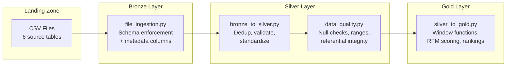

# ⚡ Spark Jobs — PySpark ETL Pipeline

> Medallion Architecture (Bronze → Silver → Gold) ETL pipeline built with PySpark 3.5.0 and Delta Lake 3.0.0.

---

## 🏛️ Pipeline Architecture



---

## 📁 Structure

```
spark-jobs/
├── src/
│   ├── common/
│   │   ├── spark_session.py     # SparkSession factory (Delta Lake configured)
│   │   ├── config.py            # Environment-aware configuration
│   │   └── logging_config.py    # Structured logging setup
│   ├── ingestion/
│   │   └── file_ingestion.py    # Landing → Bronze with schema enforcement
│   ├── transformations/
│   │   ├── bronze_to_silver.py  # Cleaning, dedup, standardization
│   │   └── silver_to_gold.py    # Aggregations, window functions
│   ├── quality/
│   │   └── data_quality.py      # Quality checks between layers
│   └── pipeline.py              # Full pipeline orchestrator
├── tests/
│   ├── conftest.py              # Shared SparkSession fixture
│   ├── test_ingestion.py        # Ingestion tests
│   ├── test_bronze_to_silver.py # Transformation tests
│   ├── test_silver_to_gold.py   # Gold layer tests
│   └── test_data_quality.py     # Quality check tests
└── requirements.txt
```

---

## 🔄 Layer Details

### Bronze — Raw Ingestion
- Reads CSV/JSON from landing zone
- Enforces explicit schemas (no schema inference in production)
- Adds metadata columns: `_ingested_at`, `_source_file`, `_batch_id`
- Writes as Parquet/Delta partitioned by date

### Silver — Clean & Validate
| Transformation | Technique |
|:---|:---|
| Deduplication | `Window + row_number()` over business key, keep latest |
| Email normalization | `lower()` + `trim()` |
| Name standardization | `initcap()` |
| Invalid filtering | Remove negative prices, future dates, null required fields |
| Type casting | Explicit schema with proper types |

### Gold — Business Aggregations
| Dataset | Key Techniques |
|:---|:---|
| `daily_sales` | `Window.partitionBy("date")`, running totals, 7-day moving average, YTD |
| `customer_360` | RFM scoring (Recency-Frequency-Monetary), `ntile(4)` for tier assignment |
| `product_performance` | `DENSE_RANK` by category and overall, revenue percentiles |
| `hourly_traffic` | Time bucketing, conversion rate = orders/sessions, bounce rate |

### Data Quality Gate
Runs between Silver → Gold. Checks:
- **Completeness:** % of non-null values per column
- **Uniqueness:** Duplicate rate on primary keys
- **Range:** Numeric values within expected bounds
- **Referential:** Foreign keys exist in dimension tables
- **Freshness:** Data timestamp within expected recency

---

## 🚀 Running

```bash
# Install dependencies
pip install pyspark==3.5.0 delta-spark==3.0.0 pytest

# Run tests
cd spark-jobs
python -m pytest tests/ -v --cov=src

# Run full pipeline
python src/pipeline.py

# Run specific stage
python -c "from src.ingestion.file_ingestion import ingest_all; ingest_all()"
```

---

## ⚙️ Configuration

Key Spark settings in `spark_session.py`:

| Setting | Value | Why |
|:---|:---|:---|
| `spark.sql.extensions` | `io.delta.sql.DeltaSparkSessionExtension` | Enable Delta Lake |
| `spark.sql.shuffle.partitions` | `200` | Optimized for medium datasets |
| `spark.sql.adaptive.enabled` | `true` | Auto-optimize query plans |
| `spark.databricks.delta.schema.autoMerge.enabled` | `true` | Handle schema evolution |

---

## 🧪 Test Coverage

Tests use a shared local `SparkSession` via `conftest.py` fixtures with temporary Delta tables.

| Test Suite | Count | What's Tested |
|:---|:---|:---|
| Ingestion | 5 | Schema enforcement, metadata columns, partition writing |
| Bronze→Silver | 8 | Dedup, normalization, filtering, type casting |
| Silver→Gold | 7 | Aggregations, window functions, RFM, rankings |
| Data Quality | 6 | Null checks, uniqueness, ranges, referential integrity |
